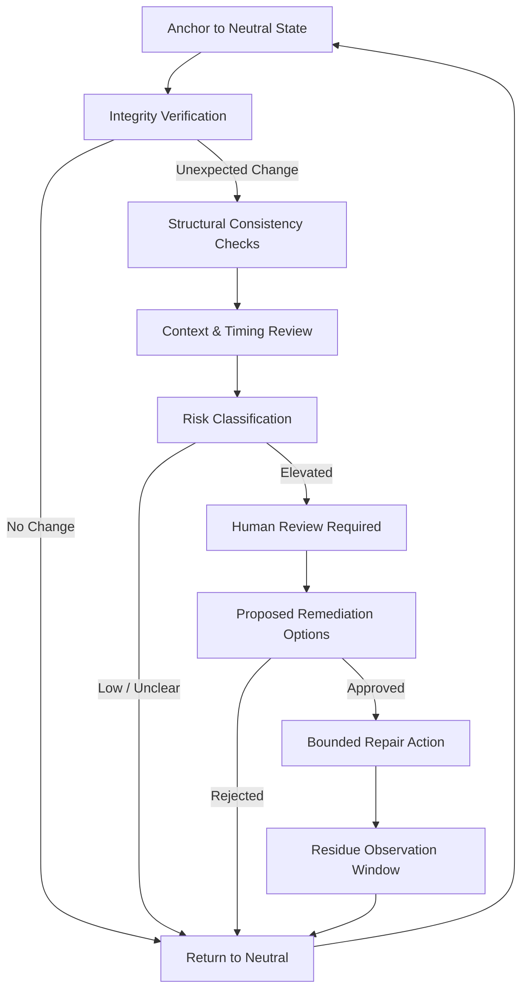

# AEGIS Integrity Loop — Diagram Overview

This diagram provides a **high-level, non-operational visualization** of the Aegis Integrity Loop.
It is intentionally abstract and designed for documentation, discussion, and education.

> No automation logic, exploits, or implementation details are included.

---

## System Flow (Conceptual)

---

## Reading the Diagram

- **Anchor to Neutral State**  
  The system always begins and ends in a stable, non-reactive mode.

- **Integrity Verification**  
  Baseline comparison to detect unexpected change.

- **Structural Consistency Checks**  
  Identification of gaps, mismatches, or incoherence.

- **Context & Timing Review**  
  Evaluation of plausibility rather than intent.

- **Human Review Required**  
  No autonomous repair is performed.

- **Residue Observation Window**  
  Post-repair monitoring before closure.

---

## Usage Notes

- Compatible with GitHub Markdown renderers that support Mermaid.
- Safe for public repositories.
- Intended for documentation only.

---

**Status:** Conceptual · Defensive · Human-in-the-Loop
